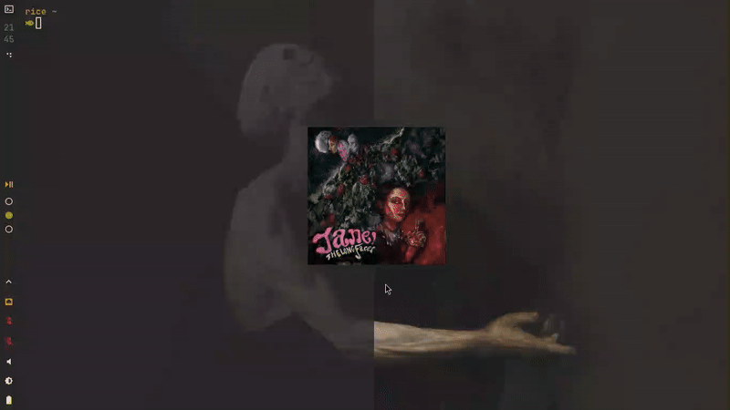

<div align="center">
  
  <h3 align="center">Cue</h3>
  <p align="center">
    A desktop music controller for <a href="https://github.com/Spotifyd/spotifyd">spotifyd</a>
  </p>
  
  
</div>

## About The Project

Cue is a minimalist audio overlay built for users who want their album art visible on screen while providing play, pause, and volume controls. 

## Why

This project was inspired by mini-players like Lofi but i didnt like how much resources they used and that they needed spotify desktop to work.

---

## Installation

Download the precompiled appimage bundle from the [Releases](https://github.com/riiced/cue/releases).

### Building From Source

You need `base-devel` and `webkit2gtk-4.1` installed on your system.

1. Clone the repository:
```bash
git clone [https://github.com/riiced/cue.git](https://github.com/riiced/cue.git)
cd cue

```

2. Build the AppImage package:

```bash
cargo tauri build

```

---

## Todo

* [ ] Add basic audio visualizations

---

## Contributing

Pull requests and feature requests are highly welcome. If you want to help improve Cue, open an issue or submit a PR.

---

## Acknowledgements

* Thanks to [spotifyd](https://github.com/Spotifyd/spotifyd) for providing the foundation for this project.
* Thanks for [Lofi Rocks](https://lofi.rocks) inspiring me on the minimalist concept.

---

## License

Distributed under the [MIT License](https://opensource.org/licenses/MIT).
